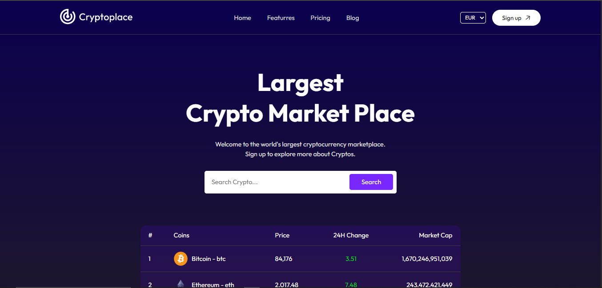

# 🚀 CryptoPlace - Cryptocurrency Market Tracker

CryptoPlace is a modern cryptocurrency marketplace that provides real-time data on various cryptocurrencies. Users can search for coins, track prices, view market trends, and explore historical data with interactive charts.



---

## 🌟 Features

✅ Real-time cryptocurrency data  
✅ Search functionality for any coin  
✅ Price, market cap, and 24-hour change tracking  
✅ Interactive charts for historical data

---

## 🛠️ Tech Stack

- **Frontend:** React.js, React Router, CSS
- **State Management:** React Context API
- **API:** [CoinGecko API](https://www.coingecko.com/en/api)
- **Charting Library:** React Google Charts

---

## 📸 Screenshots

<!-- Replace these with actual images of your project -->

  


---

## 🔧 Installation & Setup

1️⃣ Clone the repository:

```bash
git clone https://github.com/davidgraphix/cryptoplace.git
```
